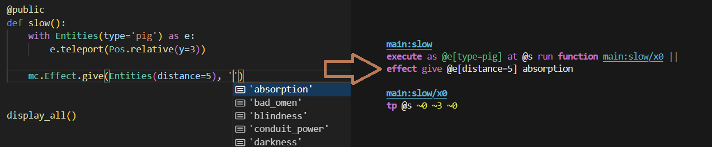
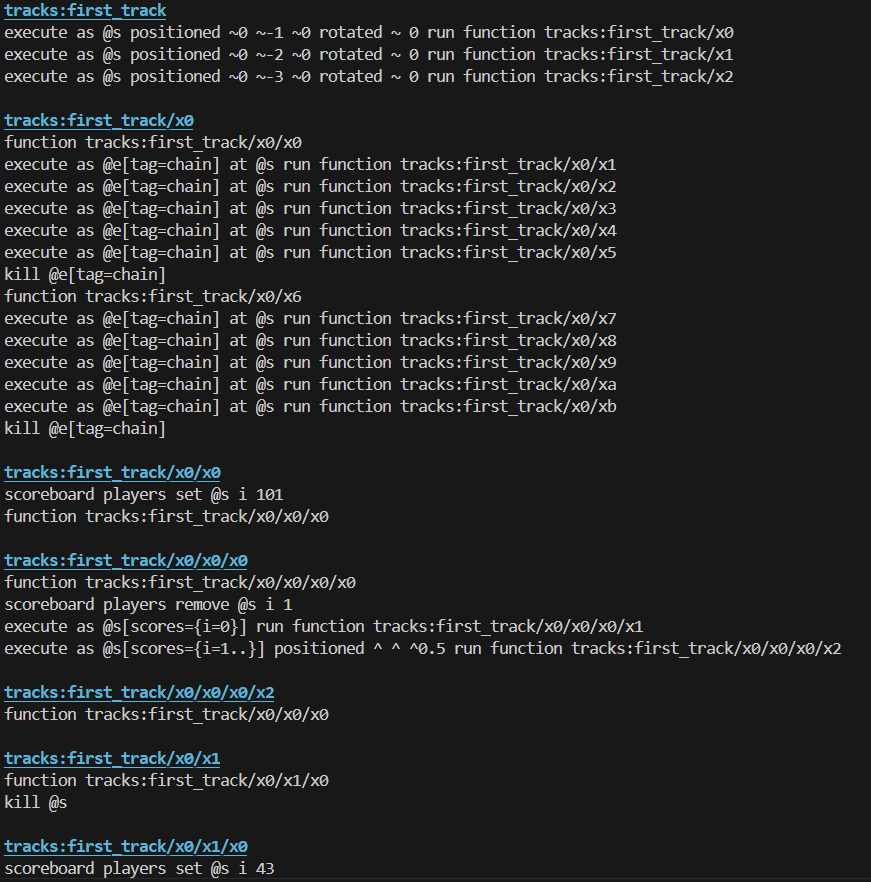

# About

This repo contains both `langcraft`, a framework built in Python for autogenerating Minecraft datapack components in a readable, maintainable way; and, `mal` (MetaAutoLang), a fully-featured language with parser and interpreter for building code autogeneration as a meta-language.  

## Langcraft

*The above shows langcraft in action on a very simple arbitrary example, showcasing the useful syntax highlighting and autocomplete*

Core features of `langcraft` include control flow, automatic optimization, and handling of entities with context wrappers. For example, `langcraft` includes a builin `ScoreTree` structure which enables switching to arbitrary functions based on a scoreboard value in log(n) time using a tree, and abstractions for basic control flow such as `If`, `While`, and functions that enable far more concise and readable syntax. The source code is available in `src/langcraft`. 

The abstraction provided by langcraft in enabling control flow is crucial since Minecraft's datapack system is purely functional, making even simple loops unintuitive and complex structures unreadable and unmaintainable. For example, running [`python -m example.tracks`](src/examples/tracks.py) in `src/` yields thousands of lines of codes necessary to efficiently enable even simple functionalities; the function generating a single simple track section in a single gametick is shown below. 

# Setup

To use langcraft, either simply include the `langcraft` directory in your source code or `pip install` it, and then use `from langcraft import *` to import all the basic builtins. To run tests and build autogenerated code, run `python -m langcraft`.
